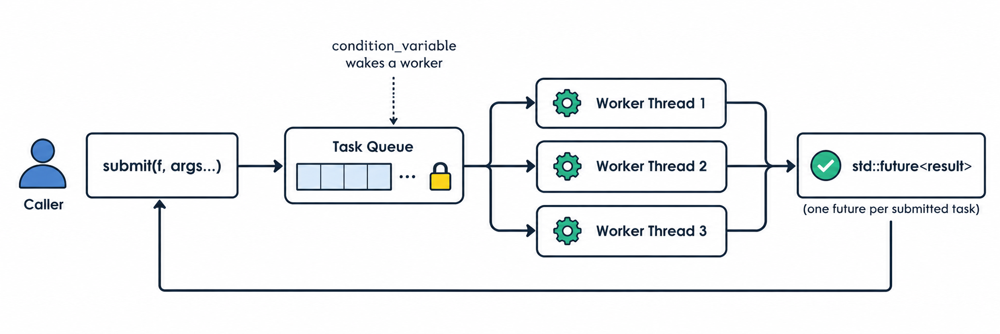

# C++ Thread Pool Library

A generic, templated thread pool built from scratch in modern C++ accepts any callable with any return type, dispatches work across a fixed set of worker threads, and returns results via `std::future`. Built specifically to go deep on templates, move semantics, RAII, and concurrency primitives, rather than wrapping an existing library.



## Features

- **Accepts any callable** - free functions, lambdas (capturing or not), function pointers with any number and type of arguments, via a variadic template `submit()`.
- **Real return values and exceptions** - results flow back to the caller through `std::future`, backed by `std::packaged_task`. A task that throws surfaces the exception at `.get()` on the caller's thread instead of crashing the pool.
- **Custom type-erased, move-only task wrapper** - tasks are stored as `std::unique_ptr<TaskBase>` in the queue, using a hand-built abstract-base/templated-derived pattern instead of `std::function`, which cannot hold non-copyable callables like `packaged_task`. This avoids the heap-allocation-plus-atomic-refcounting overhead of a `shared_ptr`-based workaround (see `docs/design-decisions.md`).
- **RAII lifecycle management** - threads are spawned in the constructor and always joined in the destructor; no dangling threads, no manual cleanup required by the caller.
- **Thread-safe task queue** - a mutex-and-condition-variable-guarded queue, with predicate-based waiting so idle worker threads sleep instead of busy-waiting.

## Example usage

```cpp
ThreadPool pool(4);

// fire-and-forget
pool.submit([]() { std::cout << "running concurrently\n"; });

// with arguments and a return value
std::future<int> result = pool.submit([](int a, int b) { return a + b; }, 3, 4);
std::cout << result.get() << "\n"; // 7

// exceptions propagate through the future
std::future<int> risky = pool.submit([]() -> int {
    throw std::runtime_error("something went wrong");
});
try {
    risky.get();
} catch (const std::exception& e) {
    std::cout << "caught: " << e.what() << "\n";
}
```

## Design

**Producer-consumer pattern.** `submit()` is the producer - it wraps a callable and its arguments, packages the result channel via `std::packaged_task`, and pushes the task onto a shared queue. Worker threads are the consumers - each runs a loop that waits on a condition variable until work is available, pops a task, and executes it.

**Why not `std::function<void()>` for the queue?** `std::function` requires its stored target to be copy-constructible. `std::packaged_task` is deliberately move-only - it owns a unique promise/future channel that can't be duplicated. Rather than reach for a `shared_ptr`-based workaround (storing the packaged_task on the heap and capturing a copyable pointer to it), the queue stores `std::unique_ptr<TaskBase>`, where `TaskBase` is a small abstract interface and `TaskImpl<F>` is a templated implementation holding the actual callable. This is type erasure without the refcounting cost - `unique_ptr`'s move is a plain pointer swap, no atomics involved.

**Exception safety.** Every task runs inside a try/catch on the worker thread. Without this, an exception escaping a thread's entry function calls `std::terminate()` and kills the entire process - not just the one task. Caught exceptions are stored by `packaged_task` and rethrown when the caller calls `.get()` on the corresponding future.

**Shutdown.** The destructor sets a stop flag under the queue's mutex, calls `notify_all()` (not `notify_one()` - every sleeping worker needs to wake up and notice shutdown, not just one), and joins every worker thread. Workers finish draining any remaining queued tasks before exiting, so pending work completes before the pool is destroyed.

## Testing

Validated manually against:

- Correct return values and correct exception propagation through `std::future`
- 5,000+ concurrently submitted tasks with no lost or duplicated work (verified via an atomically-guarded counter)
- Tasks capturing move-only types (`std::unique_ptr`) in their closures
- Destructor correctly waiting for in-flight and queued tasks before the pool tears down

A formal GoogleTest suite and a ThreadSanitizer pass (requires a Linux/Clang toolchain) are noted below as next steps rather than completed here.

## Next steps

- **Python bindings via pybind11** - expose `submit()` to Python accepting a `py::function`, with GIL released around the C++-side dispatch and reacquired when a worker thread calls back into the Python callable. (Note: Python's GIL means true parallel speedup only applies to GIL-releasing or C++-side work, not CPU-bound pure-Python callables.)
- Formal unit tests with GoogleTest
- ThreadSanitizer validation pass

## Build

```
cmake -B build
cmake --build build
```
